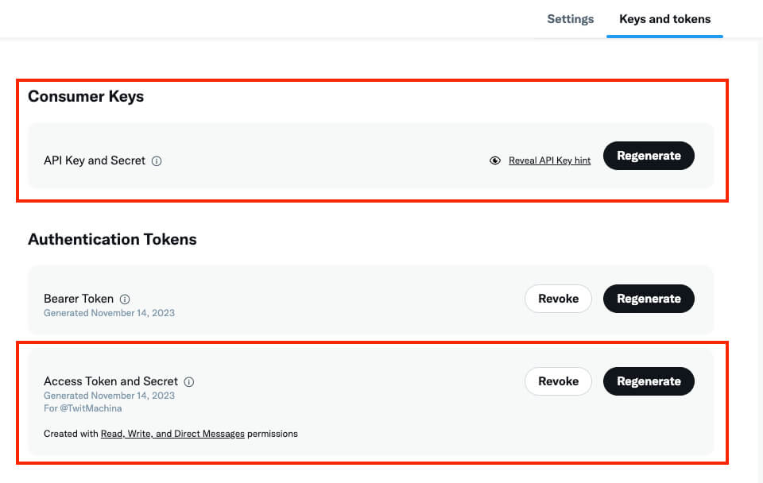

# how to make a twitter bot

## set up github and vs code

First, make an empty repository on github. Make sure that you do not
include a readme or gitignore. It has to be totally empty.

Then, open the repository from VS code: https://code.visualstudio.com/docs/sourcecontrol/github#_opening-a-repository


## configure twitter account & api access

1. Bot's Twitter Account (create a new Twitter account for the bot) -
   NOTE: It's important that you Label this account as 'Automated' or
   specify in its Bio that it's a bot: https://x.com/i/flow/signup 
2. Twitter Dev Account to access the Twitter API:
   https://developer.twitter.com/en/apply-for-access
3. A Project in your Twitter Dev Portal:
   https://developer.twitter.com/en/portal/projects-and-apps 
4. A new App under that Twitter Dev Project.
5. Get API key and secret, Access token key and secret. You may have
   to generate new pairs if you don't have them yet



## create project via command line

Back on VS Code, open your command line. We are going to create a
virtual environment for this project. We need to do this to make sure
we have the right versions of our python packages for when we deploy
them later on github's servers.

```console
# creates a virtual environment
python -m venv .venv

# activate the environment
source .venv/bin/activate

# on windows
.venv\Scripts\activate

```

## configure environments

Here we will be downloading specific packages for our twitter bot,
which is `tweepy`, `requests`, and `python-dotenv`.

Then, we will create a new file, `.env`, and add our keys from twitter
to our environment.

Finally, we will create another file, `.gitignore`, that lists our
virtual environment and twitter environment variables, so that github
later won't publish them.

```console
pip install tweepy, requests, python-dotenv
pip freeze
```

There should now be a file called `requirements.txt` that has the
verions of all your packages.

Then, create an `.env` file, copy and paste your keys into the below
format (do not include the less/greater than symbols):

```
# Consumer Keys > API Key and Secret
API_KEY=<your-API-key>
API_SECRET=<your-API-secret>

# Authentication Tokens > Access Token and Secret
ACCESS_TOKEN=<your-access-token>
ACCESS_TOKEN_SECRET=<your-access-token-secret>
```

Now, create anotother file, called `.gitignore`. In the `.gitignore`
file, type then save:

```
__pycache__
.env*
.venv*
```

Phew, that's done!

## write our tweeting script

Create a new file and call it `tweet.py`. This will be where we handle
the logic of the bot tweeting.

```python
import tweepy
import requests
# allows us to use the operating system and load environment variables 
import os
from dotenv import load_dotenv
# allows the bot to choose one artwork at random
from random import randint

# pulling the keys and secrets from our .env file
load_dotenv()
API_KEY = os.getenv("API_KEY")
API_SECRET = os.getenv("API_SECRET")
ACCESS_TOKEN = os.getenv("ACCESS_TOKEN")
ACCESS_TOKEN_SECRET = os.getenv("ACCESS_TOKEN_SECRET")

# debugging statement: checking to see we get our correct keys and secrets
print(API_KEY, API_SECRET, ACCESS_TOKEN, ACCESS_TOKEN_SECRET)

# handles authentication
client = tweepy.Client(
    consumer_key=API_KEY,
    consumer_secret=API_SECRET,
    access_token=ACCESS_TOKEN,
    access_token_secret=ACCESS_TOKEN_SECRET
)

# also handles authentication 
auth = tweepy.OAuthHandler(API_KEY, API_SECRET)
auth.set_access_token(ACCESS_TOKEN, ACCESS_TOKEN_SECRET)
api = tweepy.API(auth)

# debugging statement: making sure we have loaded the variables
print('we loaded the auth variables')

def tweet_a_woman(tweepy_client):
    # debugging: checking to see that the function is running
    print('fetching women from the MET...')

    r1 = requests.get("https://collectionapi.metmuseum.org/public/collection/v1/search?q=woman")
    parsed = r1.json()

    # grabbing a random work from the top 6000
    number = randint(1, 6000)

    # grabbing data about the individual work
    obj_id = parsed['objectIDs'][number]
    r2 = requests.get(f"https://collectionapi.metmuseum.org/public/collection/v1/objects/{obj_id}")
    parsed = r2.json()

    # getting title, artist, gender, url
    if parsed['title'] != '':
       title = f"Title: {parsed['title']}"
    else:
        title = f"Title: Unknown"
    if parsed['artistDisplayName'] != '':
       artist = f"Artist: {parsed['artistDisplayName']}"
    else:
       artist = 'Artist: Unknown'
    if parsed['artistGender'] != '':
        gender = parsed['artistGender']
    else:
        gender = 'Artist Gender: Not marked'
    url = parsed['objectURL']

    # getting image (have to use the other auth)
    image_url = parsed['primaryImage']
    img = requests.get(image_url)
    img_content = img.content
    with open('image.jpg', 'wb') as handler:
        handler.write(img_content)
    media = api.media_upload(filename='image.jpg')
    media_id = media.media_id

    # setting up the tweet text
    tweet_text = f"{title}, {artist}, {gender}. See more: {url}"
    print('tweeting women from the MET...')
    tweepy_client.create_tweet(text=tweet_text, media_ids=[media_id])
 
# calling the function with the auth data as parameter
tweet_a_woman(client)
```

## deploy the bot on github

Go to your github repository settings (on
`github.com/your_username/your_repo_name`). Once you're there, add
your keys and secrets (all four of them) to your repository under:

```
Settings -> Secrets -> GitHub Actions -> New repository secret
```

Then, back on VS Code create a new directory, `.github/workflows`. Inside, create a
folder called `actions.yml`. In that file, paste the following code:

```
on:
  schedule:
#    - cron: '0 * * * *' # at top of every hour
    - cron: '0 0 * * *' # At 00:00 every day
  
  push: 

jobs:
  build:

    runs-on: ubuntu-latest

    steps:

      - name: checkout repo content
        uses: actions/checkout@v2 # checkout the repository content

      - name: setup python
        uses: actions/setup-python@v4
        with:
          python-version: '3.10' # install the python version needed

      - name: install python packages
        run: |
          python -m pip install --upgrade pip
          pip install -r requirements.txt

      - name: run scrupt 
        run: python tweet.py
        env: 
            API_KEY: ${{ secrets.API_KEY }}
            API_SECRET: ${{ secrets.API_SECRET }}
            ACCESS_TOKEN: ${{ secrets.ACCESS_TOKEN }}
            ACCESS_TOKEN_SECRET: ${{ secrets.ACCESS_TOKEN_SECRET }}
  ```

## deployyyyyyyyyy

Add, commit, and push your changes. Then, go to twitter and see your
bot go!
